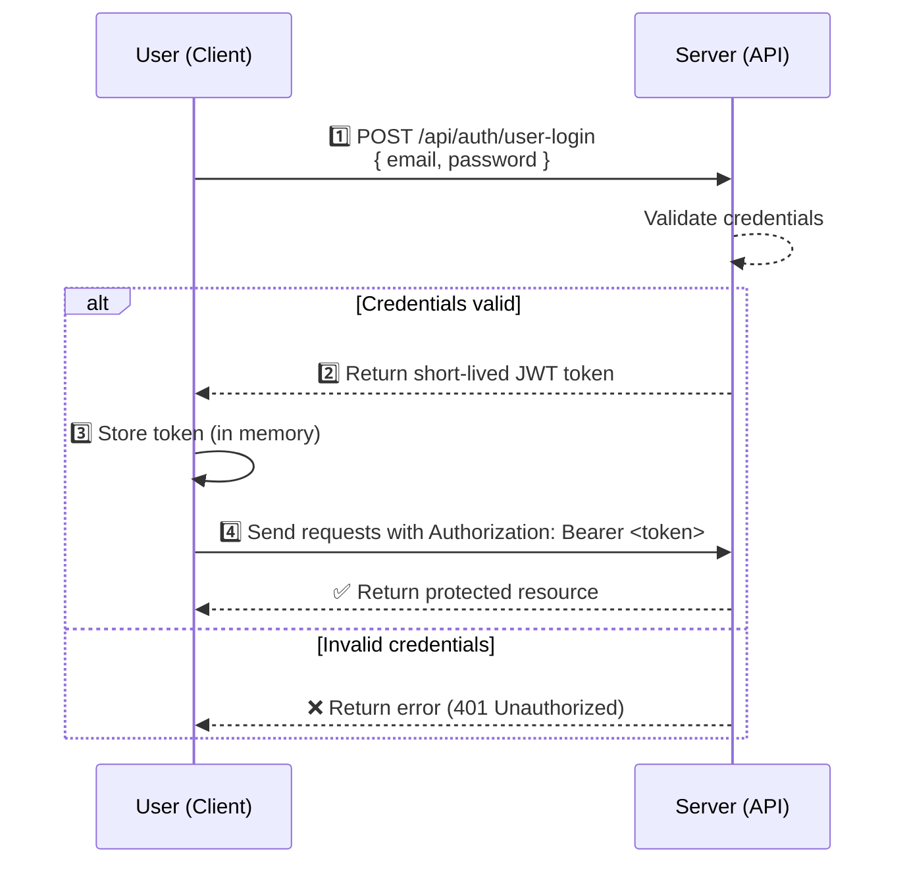

# Introduction
The Student Study Planner API provides RESTful endpoints for managing the data within this project for the Swinburne Sarawak planner system. It's used by the web application to perform CRUD operations.

## URL Formatting

- **Format String:** `{process.env.NEXT_PUBLIC_SERVER_URL}/api/{name}`
    
- **Variable (`process.env.NEXT_PUBLIC_SERVER_URL`):** `http://localhost:3000`
    
- **Variable (`{name}`):** `unit`
    
- **Result:** `http://localhost:3000/api/unit`

## Authentication
The Student Study Planner API uses **JWT Bearer Tokens** to authenticate all protected requests. Any endpoint that manages personal data (like creating plans or viewing student details) requires a valid token.

Unauthenticated requests will receive a `401 Unauthorized` response.

### Authentication Flow

### `POST api\auth\user-login` - Get Authentication Token

This endpoint is used to authenticate a user and receive a JWT.