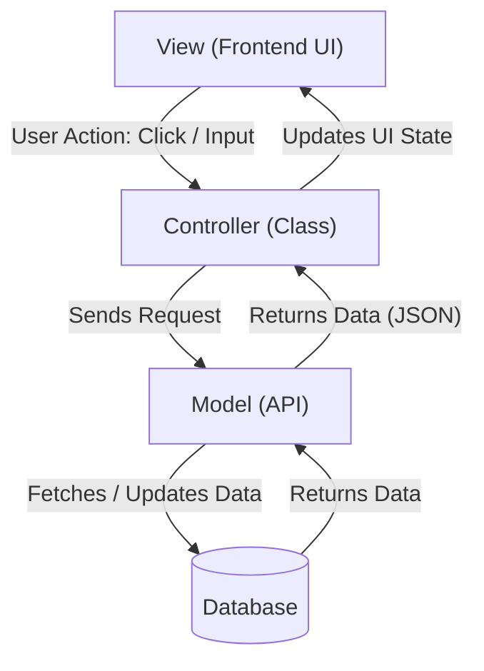

import { TransformWrapper, TransformComponent } from "react-zoom-pan-pinch";

# Architectural Pattern

## Architecture Diagram
<TransformWrapper
  defaultScale={1}
  defaultPositionX={0}
  defaultPositionY={0}
  wheel={{ step: 0.1 }}
  doubleClick={{ disabled: true }}
>
  <TransformComponent>
    
  </TransformComponent>
</TransformWrapper>
(Scroll to Zoom, Pinch to Move Around)

## Architectural Pattern: Model-View-Controller (MVC)

The Student Study Planner backend is structured following the **Model-View-Controller (MVC)** architectural pattern. This design ensures a clear separation of concerns, which makes the codebase highly maintainable, scalable, and easy to test.

1. **Controller (Class):** Handles incoming client requests and maps API endpoints to the appropriate logic. The Controller ensures that every protected request first passes through the Middleware layer.
    
2. **Auth Middleware (Security Layer):** This critical layer, placed between the Controller and the Model, is responsible for request security. It validates the presence and authenticity of the **JSON Web Token (JWT)** sent by the client. Only successful requests are allowed to proceed to the Model for data access. Failed authentication results in an immediate rejection (e.g., HTTP 401 Unauthorized).
    
3. **Model (API):** Manages the application data and core business logic. Models interact directly with the database to handle data retrieval, storage, and updates. They ensure data integrity and enforce business rules (e.g., how units are tracked, how tasks are scheduled).
    
4. **View (Frontend UI):** Although technically part of the separate frontend application, the View receives the processed data (usually JSON) from the Controller and handles all presentation logic, such as updating the user interface.
    

This separation ensures that changes to the data structure (Model) do not directly impact the request handling logic (Controller), and vice versa.