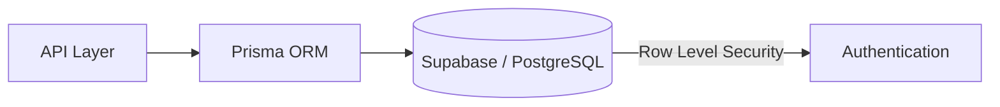

# Introduction

## Overview

The database layer is built on **Supabase** (managed PostgreSQL) with **Prisma ORM** as the Object-Relational Mapping layer. This architecture provides type safety, automated migrations, and seamless API integration.

**Architecture Flow:**



---

## Technology Stack

| Component | Technology | Purpose |
|-----------|-----------|---------|
| Database | PostgreSQL (Supabase) | Managed relational database |
| ORM | Prisma | Type-safe database access and migrations |
| Local Dev | Docker (Supabase) | Local development environment |
| Authentication | Supabase Auth | Built-in authentication layer |

---

## Database Structure

### Directory Organization

#### `./prisma`
Contains the Prisma configuration and schema:
- **`schema.prisma`** – Database schema definition with models, relationships, and constraints
- **`migrations/`** – SQL migration files for schema versioning and updates
- **`.env.local`** – Local environment variables for database connection

#### `./src/utils/db`
Database client utilities:
- **Prisma Client** – Auto-generated type-safe database client
- **Supabase Client** – Direct Supabase API access when needed
- **Database Connection Configuration** – Connection pooling and initialization

#### `./supabase`
Local development setup:
- **Docker Compose Configuration** – Containerized PostgreSQL and Supabase services
- **Seed Files** – Initial database data for development
- **Local Instance Configuration** – Development environment settings

---

## Key Concepts

### Prisma ORM

Prisma provides:
- **Type Safety** – Generated TypeScript types for all database models
- **Migrations** – Declarative schema version control
- **Query Building** – Type-safe query construction with autocomplete
- **Relationships** – Built-in support for one-to-many, many-to-many, and one-to-one relationships

### Supabase Features

- **PostgreSQL Database** – Full relational database capabilities
- **Row Level Security (RLS)** – Fine-grained access control at the row level
- **Real-time Subscriptions** – Listen to database changes in real-time
- **Managed Backups** – Automatic backup and recovery
- **Built-in Auth** – User authentication and JWT tokens

---

## Database Models

The application uses the following primary entities:

| Model | Purpose |
|-------|---------|
| `User` | User accounts and authentication |
| `Student` | Student profile information |
| `Study Plan` | Study plans created by students |
| `Study Session` | Individual study sessions and progress |
| `Subject` | Subjects/courses |
| `Task` | Study tasks and assignments |

:::note
For detailed schema information, refer to [Schema Documentation](./schema)
:::

---

## Connection & Environment

### Local Development
```bash
# Start local Supabase instance
npx supabase start

# Apply migrations
npx prisma migrate dev

# Generate Prisma Client
npx prisma generate
```

### Environment Variables
```env
DATABASE_URL=postgresql://[user]:[password]@[host]:[port]/[database]
DIRECT_URL=postgresql://[user]:[password]@[host]:[port]/[database]
```

---

## Best Practices

### Query Optimization
- Use **select** to fetch only needed fields
- Implement **pagination** for large datasets
- Use **include/select** for efficient eager loading

### Data Integrity
- Define relationships with proper constraints
- Use **unique constraints** for preventing duplicates
- Implement **not null constraints** where appropriate

### Security
- Use **Row Level Security (RLS)** policies on sensitive tables
- Never expose raw SQL queries
- Validate all user inputs before database operations
- Use Prisma's parameterized queries to prevent SQL injection

### Migrations
- Create migrations for every schema change
- Review migrations before applying to production
- Keep migration files in version control
- Test migrations locally before deployment

---

## Common Operations

### Running Migrations
```bash
# Create a new migration
npx prisma migrate dev --name add_new_feature

# Apply migrations
npx prisma migrate deploy

# Reset database (development only)
npx prisma migrate reset
```

### Database Management
```bash
# Open Prisma Studio (visual database browser)
npx prisma studio

# Generate Prisma Client
npx prisma generate

# View database schema
npx prisma db pull
```

---

## Performance Considerations

- **Indexing** – Primary keys and foreign keys are automatically indexed
- **Connection Pooling** – Supabase manages connection pooling
- **Query Caching** – Implement application-level caching where appropriate (see [Caching](./caching))
- **Lazy Loading** – Be mindful of N+1 queries; use eager loading with `include`

---

## Related Documentation

- [Schema Details](./schema) – Detailed database schema and relationships
- [Business Rules](./business_rule) – Business logic and constraints
- [Caching Strategy](./caching) – Caching implementation and best practices
- [Useful Commands](./useful_commands) – Database operation commands

---

## Troubleshooting

### Connection Issues
- Verify `DATABASE_URL` environment variable is set correctly
- Check if local Supabase instance is running: `npx supabase status`
- Ensure PostgreSQL port 5432 is not in use

### Migration Issues
- Review migration files in `./prisma/migrations`
- Check Prisma logs for detailed error messages
- Reset local database if needed: `npx prisma migrate reset`

### Type Generation
- Regenerate Prisma Client: `npx prisma generate`
- Clear node_modules and reinstall: `npm install`