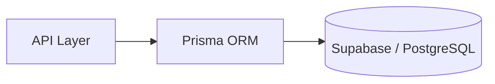

# Database Layer

:::tip  
For Setup & Installation of Database, refer to [this](../system-overview/project_setup_installation#setup)
:::

The database layer is implemented using **Supabase** as the managed PostgreSQL database, with **Prisma ORM** serving as the communication layer between the API and Supabase.

**Flow:**

---

### `./prisma`

Contains the Prisma schema (`schema.prisma`) that defines:
- Database models
- Relationships between entities
- Migrations used to keep the schema in sync

---

### `./src/utils/db`

This folder includes:
- **Prisma Client** – auto-generated client used for database queries
- **Supabase Client** – optional client for direct Supabase interactions if needed    

---

### `./supabase`

Contains the **local Docker-based Supabase instance** used for:

- Development
- Testing
- Running PostgreSQL locally before deploying